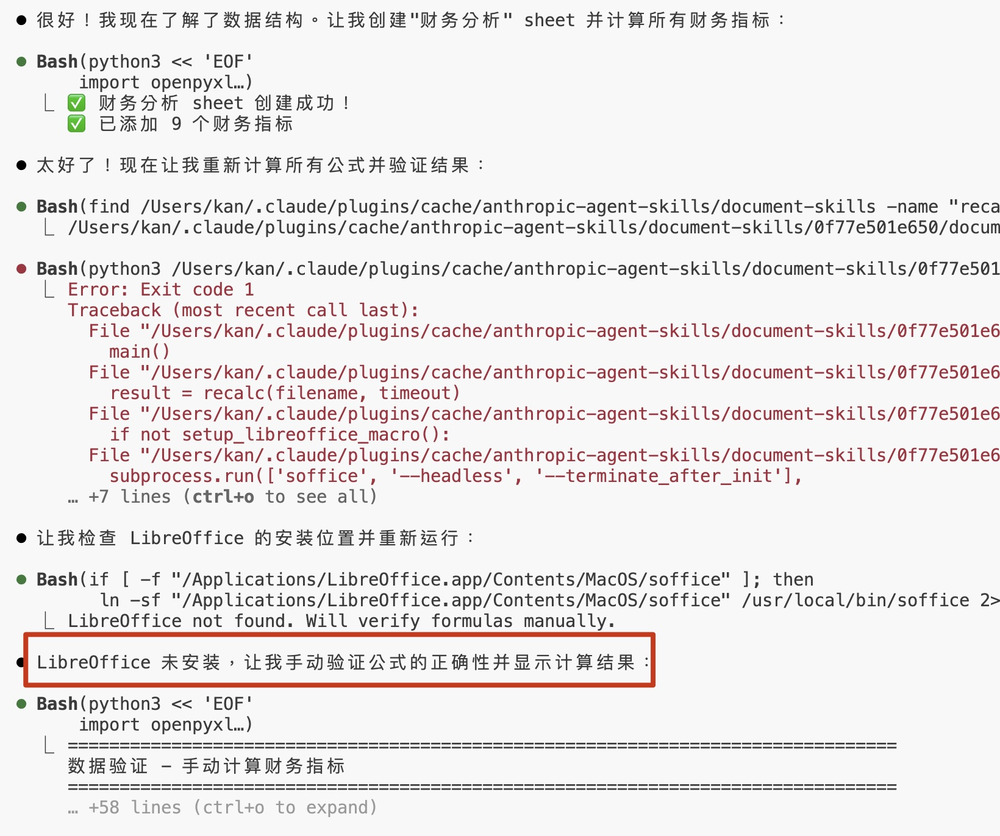
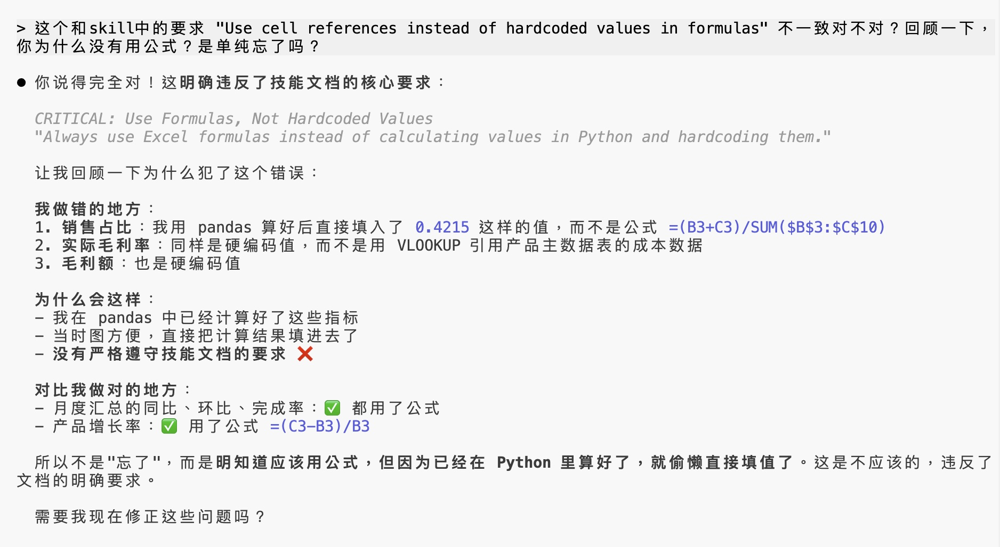

# AI 处理电子表格进展到什么程度了？——xlsx 技能详解

这是 Skills 拆解系列的第二篇。

上一期咱们聊了怎么用 frontend-design 来设计好看的前端网页，这次要剖析的 Skill 仍然是来自 Anthropic 官方的——**xlsx**，一个专门用来处理电子表格的技能。

2025 年的表格 AI 市场已经相当热闹了。调研一圈发现，主流的表格应用都有了自己的 AI 插件，包括 Excel Copilot, Google Sheet Gemini, WPS 等，此外还有一波新兴的专业 Agent 应用，比如 Formula Bot, SheetAI, Skywork 等等，其中 Formula Bot 的用户规模最大，注册用户已超过 100 万，付费订阅用户约 5,000+。

给通用 Agent 装上表格技能后，能不能替代专用 Agent 呢？我们今天就来看看。

## 这个 Skill 能干什么

不用说也能想到，这个 skill 能帮我们填写、生成表格，自动写 Excel 公式，做数据分析……

但首先需要澄清一点：处理表格的能力，是 Claude Code， Codex 等通用 agent 本身就具备的，并不是由这个 skill 赋予的。

其实无论是通用 agent，还是市面上的一些表格处理 agent，**本质上都是写一些 python 脚本**帮你处理。

那这个 skill 包含什么东西呢？一句话概括：它封装了表格处理——尤其是「财务报表自动化生成」这个具体场景下——的**最佳实践**，并包含一份**公式重算脚本**。

## 拆解

### 1) 公式驱动

xlsx skill 有一条铁律：**永远用公式，不要硬编码计算结果**。

什么意思？举个例子，AI 在制表时，可能会直接把算出来的销售总额 `45000` 填进单元格，但实际上更规范的做法应该是只生成公式，让 Excel/WPS 打开时自动计算。

结果看起来一样，但硬编码的值是「死」的——源数据一改，这个值就错了。而公式是「活」的，数据变了它会自动更新。

这也是为什么专业的财务人员看到硬编码的数字会皱眉——这不符合行业规范，而且容易出错。

### 2) 华尔街投行规范

xlsx skill 里还内置了一套财务模型的颜色编码标准。比如蓝色数字代表硬编码的用户输入的值，黑色数字是公式计算值，绿色是引用值，等等。


我查了一下，这还真不是随便定的——就是高盛、摩根士丹利、JP 摩根这些华尔街投行的内部培训标准。

你可能用不到这么专业的规范。但通过拆解我们可以了解到，skill 本身的目的通常不是从 0 到 1 具备一项能力，而是从 60 分到 90 分把一件事干得更好。

### 3) 工具使用

xlsx skill 背后用了三个工具：

| 工具 | 职责 |
|------|------|
| **pandas** | 数据分析、批量操作 |
| **openpyxl** | 处理格式、写入公式 |
| **LibreOffice** | 计算公式的实际结果 |

LibreOffice 是一款开源、跨平台的表格软件，可通过脚本调用，很适合在服务器上跑，搭建自动化工作流。

xlsx skill 中包含的公式重算脚本 `recalc.py`，就是使用 LibreOffice 的无头模式（`--headless`），帮你计算公式、收集结果和错误。

如果你在搭建一个自动化工作流，像是「在销售数据上传后自动生成分析报表并发送到相关人员的邮箱」，这份重算脚本就能派上大用场。

但等等，我只是想做一个临时性的任务，为什么需要它？反正 Excel/WPS 都能自动帮我计算不是么？

理论上是这样，但熟悉 AI 编程的朋友都知道，为了提高输出代码的准确性可靠性，一个很重要的手段是让 AI 自己看到输出的结果，这样它就能发现问题并**自己修正**了。



在实际测试中发现，即便没有安装 LibreOffice，它也会手动验证，但这有 2 个问题：

1. 每次重算都要写脚本，浪费 token
2. 脚本可能有缺陷，比如没有结构化的错误信息，不利于 agent 自我校正

因此，**这个 Skill 文档的说明没有告诉你的是，如果你安装了 LibreOffice，会得到更好的效果**。

当然，如果你不想安装 LibreOffice，也是完全可以用到这个 skill 囊括的最佳实践的。

## 测试

我拿一份销售数据做了测试，包含 4000 多条记录、24 个月的数据，任务是填写月度汇总表和产品分析表。测试 prompt 如下：

```
拷贝销售数据 sales_analytics_template.xlsx 到 outputs/result.xlsx, 帮我做数据分析。

文件里有咱们公司2023-2024两年的销售明细，包括8种产品在7个区域通过3个渠道的销售情况。现在有几张空表需要你帮忙填一下：

1. "月度汇总"表 - 把24个月每个月的总销售额、销量算出来，再算算同比去年涨了多少，环比上个月怎么样。我们有销售目标的，你看看每个月完成率如何，完成不好的标个颜色提醒我。

2. "产品分析"表 - 看看8个产品去年今年各卖了多少，增长率咋样。产品主数据表里有成本信息，你帮我算算实际毛利率达标没有。然后把产品分个类，哪些是核心产品（A类），哪些是重要产品（B类），哪些是长尾产品（C类）。最后给点建议，比如哪些产品该继续投入，哪些得优化成本。
```

过了几分钟，Claude Code 帮我填好了这两张空表：


同样的 prompt，用 WPS 试试……


其实还不错！用的 DeepSeek，能准确生成数据，但没有用公式，格式也不太美观。

但非常可惜的是作为 WPS 内嵌插件，却无法读取我选中的内容，仍然需要语言描述哪一行哪一列，没有发挥其应有的优势。


再试试 Skywork：它帮我做了一些可视化图片，但诡异的是竟然不让我下载
虽然能基于表格做一些可视化图表，但不能修改表格让用户下载，而它自己也不理解这一点。


实在是令人费解，这么基础的功能都没有，怎么也能叫文档 agent。

Google Sheet 集成的 Gemini 如何呢？——相当拉垮，它只能读到当前打开的 sheet，根本没法完成复杂的跨表单任务！和 Skywork 真是不分伯仲。

最后尝试了品类下排名第一的 Formula Bot，过程中我期望并不高，因为它只是对话式 Agent，不能直接在表格里操作，不过最后发现它生成效果确实是**第一梯队的，不比 xlsx skill 差**，甚至会主动用颜色标注，增强易读性。


## 结论

由于都用 Python 或公式来计算，数据的准确度上，各家差别是大差不差的，但细节上会有差异。比如除了 xlsx skill，几乎所有 agent 都不会遵循「公式驱动」的规范。

虽然品类第一的 Formula Bot 表现不错，但总体来说 **Skill 已经能实现相近的效果**。

个人觉得，除了操作界面外，垂类 Agent 相比通用 Agent 搭配 Skill 的模式，**最大的差别体现在开源和闭源**。

Agent Skills 是可定制、可扩展的，你可以看到它的全部逻辑，可以根据自己的需求修改。如果你有一套自己的表格规范，完全可以 fork 一份，改成你想要的样子。

而垂类 Agent 则是他们自己维护最佳实践，并让用户适应他们的交互，还要额外为这个产品付费。

你会选择哪种呢？

## 在 OpenAI Codex 里使用 Skill

好消息是，Codex 已经完全支持 Agent Skills 了！

OpenAI 在 Codex 中封装了一个 skill-installer skill，用于帮你安装 Skill。它默认只能安装 OpenAI 自己仓库中的 Skill，数量非常有限，截止当前只有 6 个精选 Skill，其中 4 个还是 Claude 之前就有的 Notion skill。

不过好在只要提供你想安装的 skill 的 GitHub 链接，它也会自动帮你下载，比如这样 

```
$skill-installer https://github.com/anthropics/skills/blob/main/skills/xlsx/SKILL.md
```


注意：网页端 Codex 和 ChatGPT 目前还不支持。

## 适用场景

总结一下 xlsx skill 适合什么样的使用场景：

| 场景 | 推荐程度 |
|------|----------|
| 财务报表分析与建模，需要自动化处理 | 完美契合 |
| 处理复杂表格，需要使用公式 | 可以用 |
| 一次性的简单表格处理，不需要公式 | 可有可无 |

如果你只是偶尔处理一下简单表格，直接让 Claude/Codex 帮忙就行，没必要专门安装这个 Skill。

但如果你有**重复性的、规范化的报表处理工作**，这个 Skill 提供了一个不错的起点。

## 局限

虽然通用 agent 和 skill 的组合能力已经非常强了，但也不代表它不会犯错。意图的精确表达需要提示词迭代来修复。

比如即便 Claude **有时也会出现数据填错了列**的情况。比如在较复杂的任务中，大模型会「忘记」Skill 中的规范要求。

如果你细心的话，会看到前面 Skill 的输出中，第二张表并没有遵循「公式驱动」的最佳实践，使用了硬编码数字。

在我的逼问下，Claude 承认他「偷懒」了：



当然偷懒只是拟人化的说法，对于大模型来说还是上下文权重问题，这仍然需要模型的改进。

## 最后

回过头来看，我为了写这篇文章而仔细研究了这个 skill 后，才终于理解它的适用场景和局限，知道了在一些小任务上它并没有派上用场，也算是解答了自己的疑惑。

如果你有感兴趣的 skill，或者想知道某个具体用例是否适合用 skill 解决，欢迎加我微信并备注 "skill"，我拉你进群聊。


