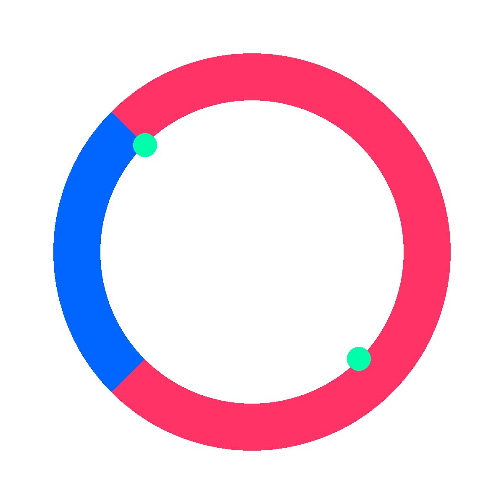

# 炒词 Logo 设计 v3
## Chaoci Platform Logo Design - Kinetic Orbits



## 设计概念

这是为"炒词"AI创作者/一人公司创业者价值互换平台设计的第三版logo，采用**"Kinetic Orbits"（动态轨道）**设计哲学。设计核心围绕**循环、交换、连接**的理念，通过极简几何形式表达平台的核心价值。

### 核心视觉语言

**双C轨道系统**：
- 两个相互交织的C形弧线，既代表品牌首字母"C"（Chaoci），又象征循环往复的价值交换
- 弧线以45°角相交，形成动态的旋转感，暗示创意的持续流动
- 开口相对的设计创造视觉张力，表达"开放"与"连接"

**配色方案**：
- **电光蓝** (#0066FF) - 代表科技、AI、数字化创作
- **活力粉** (#FF3366) - 象征创造力、热情、Z世代能量
- **电子薄荷** (#00FFAA) - 作为点缀色，标记"交换节点"

### 设计特点

#### 符合要求 ✓

**简洁性**
- 仅使用两个弧形元素 + 两个点缀
- 无复杂细节，适合各种尺寸展示
- 可完美缩放至16px favicon

**高辨识度**
- 独特的双C交织构图
- 强烈的色彩对比
- 45°旋转角度创造记忆点

**科技企业美学**
- 参考Notion、Linear、Vercel的极简风格
- 几何纯粹，无装饰元素
- 现代、专业、前沿

**Z世代审美**
- 大胆的霓虹色彩组合
- 动感、年轻、充满活力
- 数字原生视觉语言

**避免禁忌元素**
- ✓ 无区块链视觉语言（无链条、立方体、网格）
- ✓ 无对话气泡
- ✓ 清晰、现代、非加密货币风格

### 视觉隐喻

1. **循环交换**：两个C形成闭环，象征价值的持续流通
2. **开放连接**：弧线开口相对，表达平台的开放性
3. **动态能量**：45°倾斜角暗示运动和变化
4. **节点火花**：两个薄荷绿小点标记交换发生的关键节点

## 应用场景

### 数字媒体
- **Website Favicon**: 16x16px ~ 64x64px
- **社交媒体头像**: 400x400px ~ 1200x1200px
- **App图标**: iOS/Android 各种规格
- **网站Header**: 横版完整标志

### 印刷品
- 名片
- 宣传海报
- 品牌周边
- 产品包装

### 尺寸适应性
- **超小尺寸** (16-32px): 使用纯符号版，高对比度
- **小尺寸** (32-128px): 符号版，可选加文字
- **中等尺寸** (128-512px): 完整标志
- **大尺寸** (512px+): 任意变体

## 文件清单

### PDF格式（矢量，可无限缩放）
- `chaoci-logo-symbol.pdf` - 纯图形标志，800x800pt
- `chaoci-logo-full.pdf` - 图形+文字横版，1200x400pt
- `chaoci-logo-dark.pdf` - 深色背景版本，800x800pt

### PNG格式（光栅，高分辨率）
- `chaoci-logo-symbol.png` - 白色背景，1200x1200px
- `chaoci-logo-dark.png` - 黑色背景，1200x1200px
- `chaoci-logo-transparent.png` - 透明背景，1200x1200px

### 文档
- `design-philosophy.md` - Kinetic Orbits 设计哲学完整阐述
- `README.md` - 本文档

## 使用指南

### 配色规范

**主色调**
```
电光蓝 (Electric Blue)
Hex: #0066FF
RGB: (0, 102, 255)
CMYK: (100, 60, 0, 0)
用途: 主要弧线，科技感核心色

活力粉 (Vibrant Pink)
Hex: #FF3366
RGB: (255, 51, 102)
CMYK: (0, 80, 60, 0)
用途: 次要弧线，创意活力色

电子薄荷 (Electric Mint)
Hex: #00FFAA
RGB: (0, 255, 170)
CMYK: (100, 0, 33, 0)
用途: 点缀色，交换节点标记
```

**深色模式调整**
```
深色背景: #0A0A0A (近黑)
调整后蓝色: #3399FF (更亮，提高对比度)
粉色保持: #FF3366
```

### 最小尺寸

**数字媒体**
- 网页: 不小于24x24像素
- App图标: 遵循平台规范（iOS 1024x1024等）
- 社交媒体: 不小于200x200像素

**印刷品**
- 最小尺寸: 12mm x 12mm
- 推荐尺寸: 20mm x 20mm 及以上

### 留白规范

Logo四周应保留**不小于logo高度的30%**的安全留白区域：
- 确保视觉呼吸感
- 避免与其他元素拥挤
- 维持品牌专业形象

示例：
```
Logo尺寸: 100px x 100px
最小留白: 30px
```

### 禁止操作

❌ **不要**：
- 改变颜色比例或色值
- 旋转logo（已经过精心角度设计）
- 拉伸变形
- 添加阴影、渐变、特效
- 在低对比度背景上使用（确保背景对比度 ≥ 4.5:1）
- 使用模糊或低分辨率版本

✓ **允许**：
- 等比例缩放
- 在深色/浅色背景间切换预设版本
- 单色版本（紧急情况下，使用纯黑或纯白）

## 设计哲学

本logo遵循**Kinetic Orbits**（动态轨道）设计哲学：

> 以圆为基本单位，表达循环、交换与无限可能。形式被剥离至几何本质，通过弧线、交集和重叠创造新形状。色彩成为动能，饱和的色调相互碰撞，暗示速度与变化。

详细阐述见 `design-philosophy.md`

### 核心原则

1. **几何纯粹**：只使用最基本的圆弧元素
2. **动态平衡**：非对称但精确平衡的构图
3. **色彩动能**：高饱和度色彩创造视觉能量
4. **精准执行**：每条曲线、每个角度都经过深思熟虑

## 技术规格

### 生成方式

Logo使用Python + ReportLab（PDF）和PIL（PNG）生成：

```bash
# 生成所有PDF矢量版本
python3 create_logo.py

# 生成所有PNG光栅版本
python3 create_png_versions.py
```

### 几何参数

```python
# 核心参数（基于800pt画布）
arc_radius = 240pt          # 弧线半径
stroke_width = 75pt         # 线条粗细
rotation_angle = 45°        # 旋转角度
arc_span = 270°             # 单个C的弧度
dot_radius = 18.75pt        # 节点点半径
```

### 文件格式

**PDF**
- 格式: PDF 1.4+
- 色彩空间: RGB
- 可编辑: 是（矢量路径）

**PNG**
- 分辨率: 1200x1200px @ 300 DPI
- 色彩深度: 24-bit RGB / 32-bit RGBA
- 压缩: 优化压缩，无损

## 品牌应用示例

### Website
```html
<!-- Favicon -->
<link rel="icon" type="image/png" href="chaoci-logo-symbol.png">

<!-- Header Logo -->

```

### 社交媒体
- **Twitter/X**: 使用 `chaoci-logo-symbol.png` (400x400px crop)
- **LinkedIn**: 使用 `chaoci-logo-symbol.png` (300x300px)
- **微信公众号**: 使用透明背景版，建议圆形裁切

### 印刷
- 使用PDF矢量版本以确保最佳质量
- CMYK转换时注意色彩校准
- 建议先打印样张确认效果

## 设计迭代历史

**v3.0** (2026-01-12) - Kinetic Orbits
- 采用双C轨道设计理念
- 极简几何形式
- 参考科技企业美学
- 避免气泡和区块链元素
- 大胆Z世代配色

**v2.0** - 气泡碰撞版
- 三气泡碰撞设计（已废弃）

**v1.0** - 初代设计

## 设计团队

- **设计哲学**: Kinetic Orbits Movement
- **视觉执行**: Claude Code + canvas-design skill
- **技术实现**: Python (ReportLab, PIL)
- **品牌策略**: 基于AI创作者社区需求

---

**版本**: v3.0
**日期**: 2026-01-12
**状态**: ✅ 最终版本，可投入使用
**授权**: 炒词平台专用品牌资产
