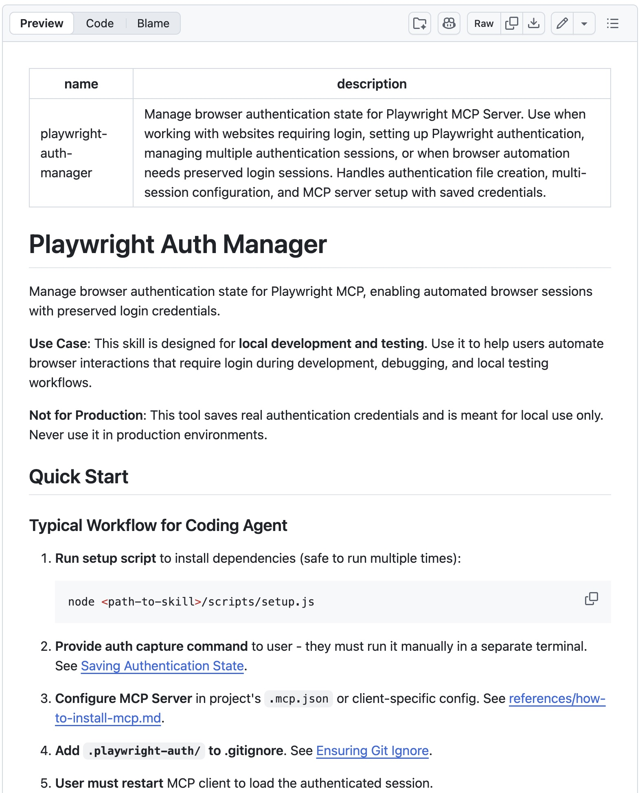
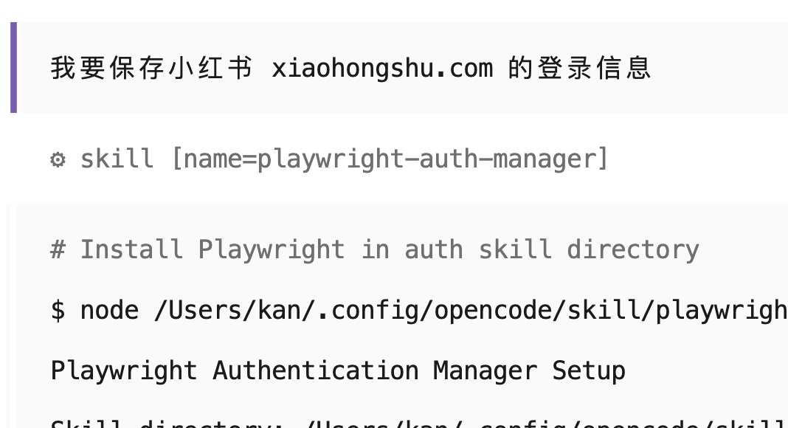
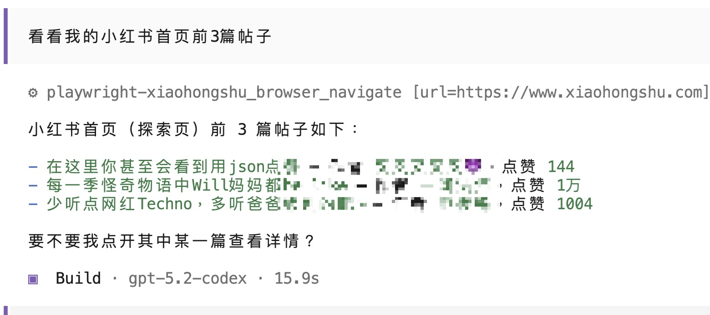

# 如何让 Claude Code 用你的身份登录网站（附 OpenCode 安装 Skill 方法）

拆解过两个 Anthropic 官方的 Skill 之后，今天我来发布一个自研 Skill。

这个 Skill 将引导你完成网站的登录流程，将认证信息保存到一份 JSON 文件，并配置一个相应的 MCP 服务。这样 Agent 就能自动用你的身份打开网站了。

## 痛点

做本地开发的时候，你有没有遇到过这种情况：

- 需要测试不同用户看到的界面是否正确
- 需要检查不同权限用户的展示效果
- 需要验证多账号场景下的数据隔离

然后你就开始了：

登出当前账号 → 登录测试账号 A → 测试 → 登出 → 登录测试账号 B → 再测试 → 登出 → 切回自己的账号……

尤其是有些网站登录流程还特别复杂，两步验证、验证码什么的，切换一次账号就要折腾好几分钟。

更别提让 Coding Agent 帮你干活了——它打开浏览器，看到的是登录页面，它不知道你的账号密码，也不能像你一样"记住"登录状态。它不能直接看到你登录后的视角，也测不了需要登录才能使用的功能。每次都要在 playwright mcp 启动的浏览器窗口中手动操作，如果想切换不同用户就更麻烦了。

于是我做了这个叫 `playwright-auth-mannager` 的 Skill。

原理很简单：你手动登录一次，脚本把你的登录信息（cookies + localStorage）保存到一个 JSON 文件，Agent 帮你配置好 MCP 自动加载。



## Demo

场景：本地开发一个社区网站，需要测试不同用户的展示效果。


我只需要告诉 Agent：「帮我保存本地开发网站的登录信息」。

它会引导我运行一个脚本，浏览器自动打开，我手动完成 OAuth 登录，然后按 Enter，认证信息就保存好了。整个过程不到一分钟。

保存好之后，我再跟 Agent 说：「用刚才保存的账号，帮我发一个测试帖子」。


Agent 直接就开始干活了——它自动处于已登录状态，不需要我再操心登录的事。

登录 Reddit 等各种平台也都不在话下。


在做网站开发时，你可以保存两份认证，配置两个 MCP 实例，现在你就可以跟 Agent 说：

```
开发付费商品发布功能，用账号 A 发布一份付费产品，然后用账号 B 登录网站检查展示效果」。
```

Agent 无缝切换，自动帮我调试、改 bug，我只需要看结果，非常爽。

## Skill 内容

除了基本的 SKILL.md 外，这个 Skill 还包含一些参考文档，指导不同的 Coding Agent 客户端配置 MCP 的方法，以及两个脚本：

**setup.js**：环境准备，在 Skill 目录内安装 Playwright，不会污染你的项目。运行一次就行。

**save-auth-state.js**：保存认证，打开浏览器让你登录，按 Enter 后把 cookies 和 localStorage 保存到 JSON 文件。文件很小，5-50KB。

安全方面，脚本会自动检查 .gitignore，防止你把敏感的认证文件提交到代码仓库。

## 如何使用

你只需要在你的 Claude Code / OpenCode / Codex 中输入

```
安装这个 skill https://raw.githubusercontent.com/kanlac/agile-dev/refs/heads/main/skill-install-guide.md
```

它就能自动帮你安装好了，就这么简单。

安装好 Skill 后，直接跟 Agent 说你的需求就行。比如「我想保存小红书 xiaohongshu.com 的登录信息」，它就能自动加载这个 skill，并指导你完成操作。

**示例对话**：

```
你：我想保存本地开发网站 localhost:3000 的登录信息

Agent：好的，我来帮你配置。请在新的终端窗口运行以下命令：
    node <path>/save-auth-state.js --url http://localhost:3000 --user dev-account

    运行后：
    1. 浏览器会自动打开
    2. 手动登录你的账号
    3. 登录完成后回到终端按 Enter

    然后我会帮你配置 MCP Server 和 .gitignore
```

```
你：请用账号 A 的身份登录网站，帮我发一个测试帖子

Agent：好的，我会使用账号 A 的认证状态。
    （Agent 自动处于登录状态，直接执行操作）
```

不需要记命令、不需要学配置，说出需求即可。

更高级的用法也是有的，比如自动帮你做社交矩阵，或者每天定时抓取整理实时资讯输出 json。这就是发挥想象力的地方了。不过要注意小心被平台封号哦。

## 在 OpenCode 中使用

最近 OpenCode 特别火，它是一个开源的 Coding Agent 客户端。我也下载试了一下，确实不错！Claude Code 支持的功能，Skills, Subagents, Hooks, Slash Commands, tab 切换模式…它基本都有。非常好用，我已经爱上了。

甚至它还能让你直接使用 Codex/Gemini 的订阅！只需要运行:

```bash
opencode auth login
```

这个命令会启动 ChatGPT 登录流程。完成登录后，你就能在 OpenCode 中使用 Codex 订阅了！

虽然官方仍然支持添加 Claude Code 认证，但我不敢用，怕被 Anthropic 封号。

按前面说的方式安装好 Skill 之后，演示一下在 OpenCode 中使用的效果，保存小红书登录的信息：





完美！

遗憾的是，虽然现在主流 agent 工具都已支持 Agent Skills，但分发方式还尚未完善。

为了简化用户的安装过程，我需要写一篇给 agent 读的手册，还要写一篇 MCP 配置手册，而且也没有办法实现 skills 的自动更新（目前只有 Claude Code 能够通过安装 GitHub marketplace 的方式实现自动更新）。这对于 Skills 生态至关重要。期待未来几个月协议更新能补上这块空缺。

---

如果你有感兴趣的 Skill，或者想知道某个具体用例是否适合用 Skill 解决，欢迎加我微信并备注 "Skill"，我拉你进群聊。


