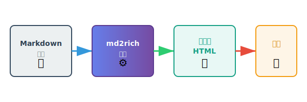

# md2rich 示例文档

这是一个演示 Markdown 转富文本功能的示例文档。


## 功能特性

md2rich 是一个强大的 Markdown 转富文本工具，支持：

- **代码高亮**：支持多种编程语言的语法高亮
- **表格**：完美支持 Markdown 表格
- **脚注**：支持脚注引用[^1]
- **多主题**：提供多种精美主题
- **剪贴板集成**：一键复制到富文本编辑器

## 代码示例


### JavaScript 代码

```javascript
function greet(name) {
  console.log(`Hello, ${name}!`);
  return `Welcome to md2rich`;
}

// 调用函数
const message = greet('World');
```

### Python 代码

```python
def calculate_sum(numbers):
    """计算数字列表的总和"""
    total = sum(numbers)
    return total

# 使用示例
result = calculate_sum([1, 2, 3, 4, 5])
print(f"总和: {result}")
```

## 表格展示

下面是一个功能对比表格：

| 功能 | md2rich | 其他工具 | 说明 |
|------|---------|----------|------|
| 代码高亮 | ✅ | ⚠️ | 支持多种语言 |
| 主题切换 | ✅ | ❌ | 内置多个主题 |
| 剪贴板复制 | ✅ | ❌ | 一键复制粘贴 |
| 微信兼容 | ✅ | ⚠️ | 完美适配 |

## 引用样式

> 优秀的工具应该让复杂的事情变得简单。
>
> md2rich 专注于提供最佳的 Markdown 到富文本的转换体验。

## 列表示例

### 无序列表

- 第一项
- 第二项
  - 嵌套项 2.1
  - 嵌套项 2.2
- 第三项

### 有序列表

1. 安装依赖
2. 准备 Markdown 文件
3. 运行转换命令
4. 复制到目标平台

## 强调和样式

这是**粗体文本**，这是*斜体文本*，这是~~删除线文本~~。

你也可以使用`行内代码`来突出显示关键词。

## 图片支持

md2rich 支持多种图片格式：

- **SVG 矢量图**：上面展示的图标都是 SVG 格式，可以无损缩放
- **PNG/JPG**：支持常规位图格式
- **在线图片**：支持通过 URL 引用的图片

示例 - 在线图片（需要网络连接）：


## 链接

访问 [GitHub](https://github.com) 了解更多开源项目。

---

## 工作流程

下面是使用 md2rich 的完整工作流程：



## 总结

md2rich 让 Markdown 转换变得简单高效。立即开始使用吧！

[^1]: 这是一个脚注示例，用于提供额外信息。
